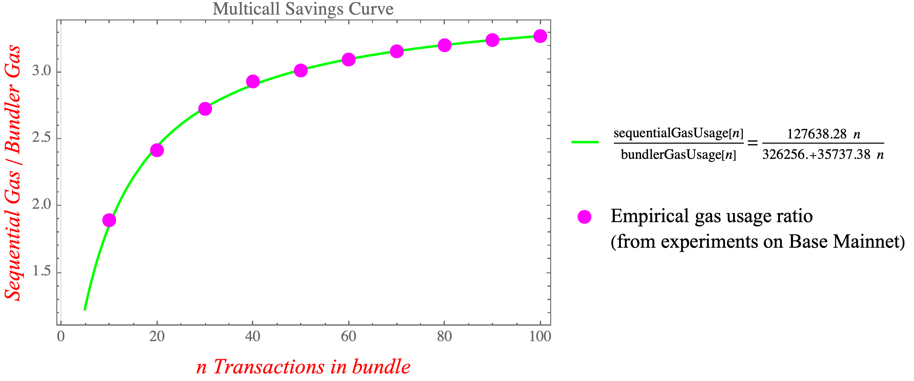

# Ethereum Gas Savings with Compass Bundler

This document outlines the Ethereum gas savings when using Compass Bundler for executing DeFi transactions compared to sequential execution.

## How much gas do you save?

We conducted tests on the Base mainnet by repeatedly running representative DeFi transaction sequences, comparing gas costs with and without using Compass Bundler.

### Experiment 1: 10 Transactions Bundled

The transaction sequence included:

1. SET\_ALLOWANCE
2. SET\_ALLOWANCE
3. SET\_ALLOWANCE
4. SET\_ALLOWANCE
5. AAVE\_SUPPLY
6. AAVE\_BORROW
7. AAVE\_REPAY
8. AAVE\_WITHDRAW
9. UNISWAP\_SELL\_EXACTLY
10. UNISWAP\_BUY\_EXACTLY

Please find the transaction hashes and [complete experimental results here](./gas_usage_reports/)

On average, bundling these 10 transactions into a single atomic transaction saves **approximately 47% in gas costs** (1.89x less gas).

| Execution Method | Average Gas Used |
| ---------------- | ---------------- |
| Sequential       | 1,276,383        |
| Bundler          | 674,067          |

### Experiment 2: Larger Transaction Bundles

We extended our tests with bundles ranging from 10 to 100 transactions. Gas savings increase with bundle size (but with diminishing returns):

* **2x savings** at **11 transactions**
* **3x savings** at **47 transactions**

| Bundle Size | Gas Savings |
| ----------- | ----------- |
| 10          | 47.89%      |
| 30          | 64.05%      |
| 50          | 68.88%      |
| 70          | 68.34%      |
| 100         | 69.45%      |

# Conclusion
Compass Bundler significantly reduces Ethereum gas expenses, particularly as bundle sizes grow.

